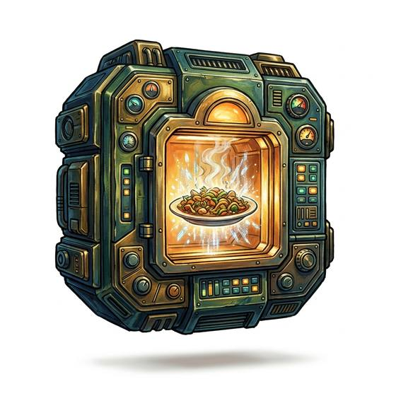

# Food synthesiser

{.illus}

*Set: Expansion*

*aka: ______________________________*

*Food, water and cooking · Needs: far future · far future*

A humming cabinet the size of a travel chest that builds a hot meal out of stored feedstock, following a recipe held in its memory. Dinner arrives on a tray, steaming and correctly seasoned, and tastes almost exactly like the real thing. Crews on long voyages swear by it for a month and complain about it for years. It needs power, fresh cartridges of feedstock and a cook's patience with its menus, and when it breaks, nobody aboard knows how to boil an egg.

## Game block

- **Bonus:** 0
- **Penalty:** 0
- **Used for:** [Cooking](../Skills/cooking.md)
- **Weight:** 8 kg · **Needs:** far future · **Price:** 30 G
- **Also known as:** matter kitchen

## Not to be confused with

*[Nutrient Paste](nutrient-paste.md)*, which is already food, only duller; the synthesiser makes proper meals but needs feedstock and power.

