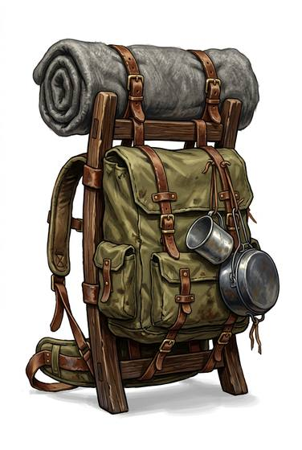

# Frame backpack

{.illus}

*Set: Expansion*

*aka: ______________________________*

*Carrying and containers · Needs: electricity · modern*

A large pack slung on a rigid frame, with a padded belt that carries the weight on the hips instead of the shoulders. It is built for long marches with everything needed for a week or more in the wilds, and it makes a heavy load feel almost reasonable. It is also bulky and top-heavy, and ducking out of the way of anything while wearing one is a clumsy business.

## Game block

- **Bonus:** +1 Lifting & Carrying long marches; +1 Endurance long marches
- **Penalty:** −1 Dodge while worn
- **Used for:** —
- **Weight:** 2.5 kg · **Needs:** electricity · **Price:** 5 S
- **Also known as:** hiking pack, external frame pack

## Not to be confused with

*[Rucksack](rucksack.md)*, the smaller soft pack for everyday loads, lighter and far more nimble.

