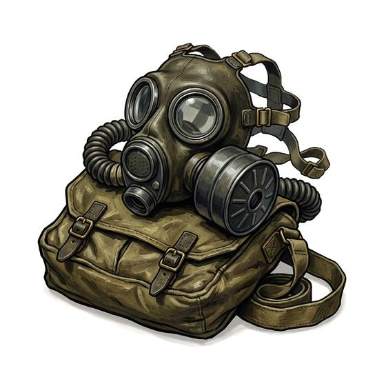

# Gas mask

{.illus}

*Set: Expansion*

*aka: ______________________________*

*Environment and survival gear · Needs: electricity · modern*

A rubber face with round glass eyes and a snout ending in a screw-on filter canister. It seals tight against the skin and strains poison gas and thick smoke out of every breath. Soldiers carry them in pouches at their hip; civilians keep them in cupboards and hope. Inside one, the world narrows to two small windows, voices come out muffled and strange, and every hard effort becomes a fight for air.

## Game block

- **Slot:** face
- **Bonus:** +2 END against gas and smoke
- **Penalty:** −1 Perception narrow view; −1 CHA speaking through it; −1 Endurance hard breathing over long efforts
- **Used for:** —
- **Weight:** 1 kg · **Needs:** electricity · **Price:** 5 S
- **Also known as:** respirator

## Not to be confused with

the *[Breathing Apparatus](breathing-apparatus.md)*, which brings its own air instead of filtering what is there, and so works even where there is no oxygen at all.

