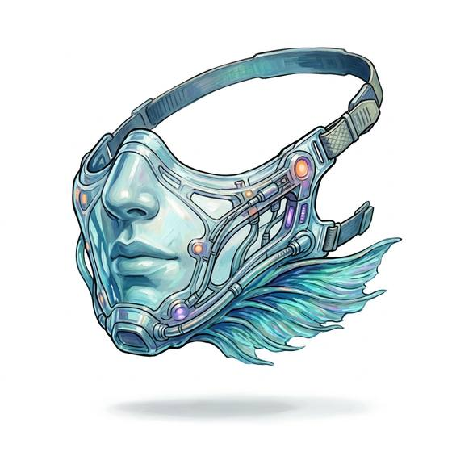

# Gill mask

{.illus}

*Set: Expansion*

*aka: ______________________________*

*Environment and survival gear · Needs: far future · far future*

A slim mask of dark, gleaming membrane that covers the lower face, drawing oxygen straight out of the water through thousands of tiny pores. A diver wearing one needs no tanks and leaves no bubbles, and can stay down as long as food and cold allow. It feels deeply wrong for the first few breaths. After that, many divers find the open sea more comfortable than the crowded surface.

## Game block

- **Slot:** face
- **Bonus:** +3 Diving staying down without tanks
- **Penalty:** 0
- **Used for:** [Diving](../Skills/diving.md)
- **Weight:** 0.3 kg · **Needs:** far future · **Price:** 30 S
- **Also known as:** water breather

## Not to be confused with

the *[Scuba Set](scuba-set.md)*, which carries a limited supply of compressed air in a tank rather than drawing it from the water.

