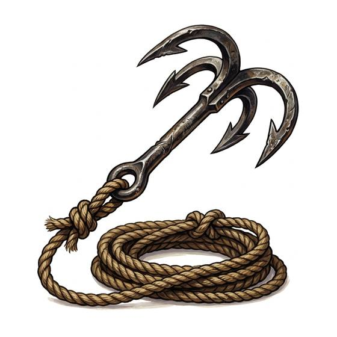

# Grappling hook

{.illus}

*Set: Expansion*

*aka: ______________________________*

*Rope, climbing and travel · Needs: iron · any*

A heavy iron hook with three or four curved prongs and a ring for a rope, whirled and thrown up at a wall top, a window ledge or a ship's rail. When it catches, the climb can begin. When it doesn't, it falls back with a clatter. Thrown onto stone, it rings like a bell and brings guards to see what the noise was.

## Game block

- **Bonus:** +1 Climbing reaching a first hold
- **Penalty:** −1 Stealth when thrown onto stone
- **Used for:** [Climbing](../Skills/climbing.md), [Throwing](../Skills/throwing.md)
- **Weight:** 2 kg · **Needs:** iron · **Price:** 3 S
- **Also known as:** grapnel

## Not to be confused with

*[Folding Grapnel](folding-grapnel.md)*, which folds flat and is padded for quieter work.

