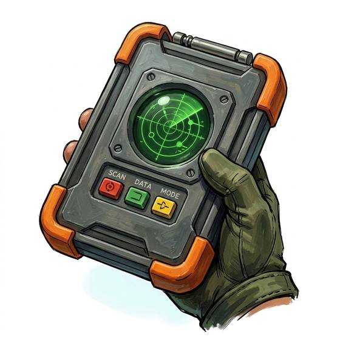

# Handheld scanner

{.illus}

*Set: Expansion*

*aka: ______________________________*

*Optics, sensing and scanners · Needs: spaceflight · space-faring*

A palm-sized device with a folding screen and a row of sensor eyes, swept slowly across a room, a body or a strange stain on the floor. In one pass it reads the air, the warmth of things, the energy in the walls and whether anything nearby is alive. It is a generalist, good at most tasks and best at none, which is exactly why explorers and investigators keep one in a pocket.

## Game block

- **Bonus:** +1 Investigation analysing a scene; +1 Searching finding hidden or small things; +1 Life Sciences identifying samples
- **Penalty:** 0
- **Used for:** [Communications & Sensors](../Skills/communications-and-sensors.md)
- **Weight:** 0.5 kg · **Needs:** spaceflight · **Price:** 10 S
- **Also known as:** multi-scanner, field scanner

## Not to be confused with

the *[Advanced Multi-Scanner](advanced-multi-scanner.md)*, its far more capable descendant, which maps a whole room down to its structure.

