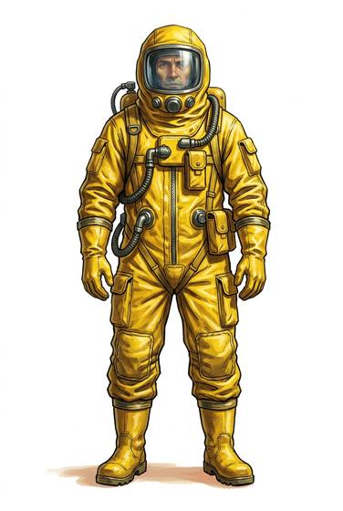

# Hazmat suit

{.illus}

*Set: Expansion*

*aka: ______________________________*

*Environment and survival gear · Needs: computing · modern*

A loose, fully sealed suit of thick plastic or rubberised fabric, with a wide visor, taped gloves and boots, and its own air supply. It keeps poisons, fallout dust and plague away from every part of the body. Decontamination crews and plague doctors of later ages move slowly in them, sweating and careful. The gloves make fine work difficult, the suit bakes its wearer in any heat, and every step rustles loudly.

## Game block

- **Slot:** full body
- **Bonus:** +2 END against chemicals, radiation dust and disease
- **Penalty:** −2 DEX thick gloves; −2 END in heat; −1 Stealth rustling plastic
- **Used for:** [Environment Suits](../Skills/environment-suits.md)
- **Weight:** 6 kg · **Needs:** computing · **Price:** 25 S
- **Also known as:** chemical suit, biohazard suit

## Not to be confused with

the *[Hazmat Hood](hazmat-hood.md)*, which protects only the head and lungs and can be pulled on in seconds.

