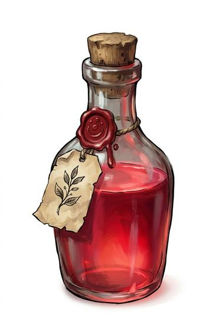

# Healing draught

{.illus}

*Set: Core*

*aka: ______________________________*

*Medicine and healing · Needs: pottery · any*

A thick clay or glass flask of dark, strong-smelling brew, stoppered with wax. It is made from roots, blood-rich broths, strong spirit and whatever else the maker swears by, and drinking it sets a wounded body on the mend with startling speed. Temple healers and village wise-women sell it, and soldiers buy as many as they can afford. The taste is part of the cure, or so the makers say.

## Game block

- **Bonus:** +1 Life restores Life when drunk (Quick Heal)
- **Penalty:** 0
- **Used for:** —
- **Weight:** 0.3 kg · **Needs:** pottery · **Price:** 1 S
- **Also known as:** healing potion, restorative tonic

## Not to be confused with

*[Pain-Easing Tea](pain-easing-tea.md)*, which only dulls the hurt; the draught actually mends the wounds behind it.

