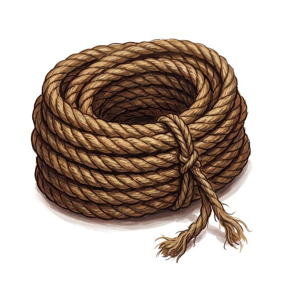

# Hemp rope

{.illus}

*Set: Core*

*aka: ______________________________*

*Rope, climbing and travel · Needs: agriculture · any*

Ordinary laid rope of three twisted strands of hemp or similar fibre, sold by the coil in every market from the age of farming onward. It ties loads to mules, lowers buckets down wells, hangs washing and holds boats to piers. It is rough on the hands, heavy when wet, and the most reliable friend a traveller can have.

## Game block

- **Bonus:** 0
- **Penalty:** 0
- **Used for:** [Knots & Rope Work](../Skills/knots-and-rope-work.md), [Climbing](../Skills/climbing.md), [Sailing & Seamanship](../Skills/sailing-and-seamanship.md)
- **Weight:** 2.5 kg · **Needs:** agriculture · **Price:** 1 S
- **Also known as:** manila rope, ship's line

## Not to be confused with

*[Silk Rope](silk-rope.md)*, which is lighter and hides in a sleeve, but costs a great deal more.

