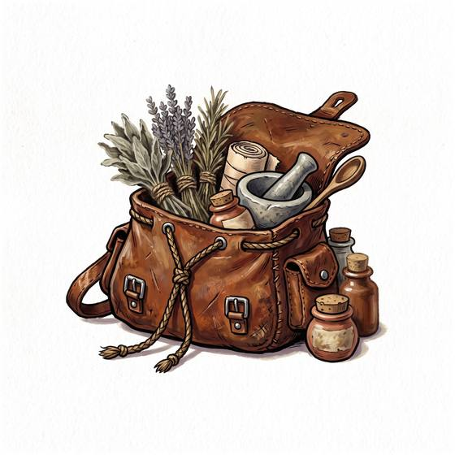

# Herb pouch

{.illus}

*Set: Core*

*aka: ______________________________*

*Medicine and healing · Needs: stone tools · any*

A soft leather pouch with little bundles and twists of dried roots, leaves and bark inside, each one known by smell and feel to its owner. It holds the answers to fever, gripe, sleeplessness and a dozen common complaints, gathered from the fields and woods near home. In familiar country the healer can refill it from any hedgerow. Far from home, the plants look different, the old remedies run out, and guesswork starts to replace knowledge.

## Game block

- **Bonus:** +1 Remedies & Pharmacy with plants of the home region
- **Penalty:** −1 Remedies & Pharmacy in unfamiliar lands
- **Used for:** [Remedies & Pharmacy](../Skills/remedies-and-pharmacy.md), [First Aid](../Skills/first-aid.md)
- **Weight:** 0.3 kg · **Needs:** stone tools · **Price:** 2 C
- **Also known as:** medicine bag, simples pouch

## Not to be confused with

*[Apothecary Chest](apothecary-chest.md)*, which holds a full dispensary of prepared medicines; the herb pouch is a gatherer's handful of local plants.

