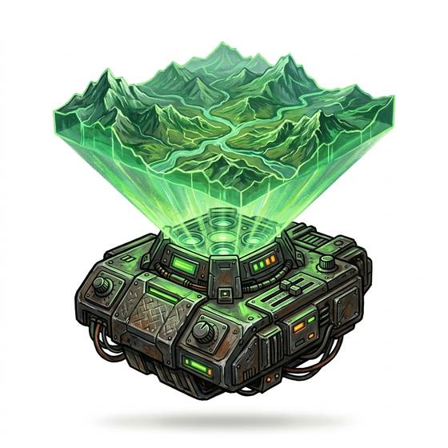

# Holographic map

{.illus}

*Set: Expansion*

*aka: ______________________________*

*Navigation and timekeeping · Needs: spaceflight · space-faring*

A flat projector that raises the land in light above a table: hills, rivers and buildings hanging in the air, glowing and faintly translucent. Officers lean over it, turn it with a gesture, zoom into a single street or pull back to see a whole continent. Friendly units can be marked, routes drawn and ambushes rehearsed before anyone leaves the ship. It needs power, a clean data feed and somewhere dry to stand.

## Game block

- **Bonus:** +2 Military Tactics planning on terrain; +1 Wayfinding mapped land
- **Penalty:** 0
- **Used for:** [Geography](../Skills/geography.md)
- **Weight:** 2 kg · **Needs:** spaceflight · **Price:** 15 S
- **Also known as:** 3d map table

## Not to be confused with

the *[Printed Map](printed-map.md)*, which works without power but can't show the ground in depth or change its view.

