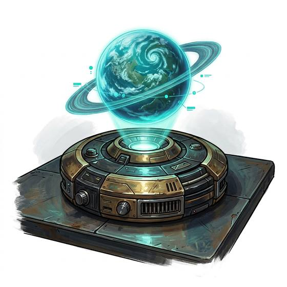

# Holographic projector

{.illus}

*Set: Expansion*

*aka: ______________________________*

*Power, electronics and computing · Needs: spaceflight · space-faring*

A small disc or box that throws a life-sized, glowing three-dimensional image into the air above it. Officers use it to show maps and battle plans; teachers use it to show distant worlds. It can also project a convincing decoy, a figure in a doorway or a crate that isn't there. Its images shimmer slightly, which the observant can learn to spot.

## Game block

- **Bonus:** +1 Oratory & Debate presenting plans and maps; +1 Deception throwing a decoy image
- **Penalty:** 0
- **Used for:** [Media Production](../Skills/media-production.md)
- **Weight:** 1 kg · **Needs:** spaceflight · **Price:** 40 S
- **Also known as:** holo-projector

## Not to be confused with

the *[Holographic Disguise](holographic-disguise.md)*, which paints a false face over its wearer rather than throwing a free-standing image.

