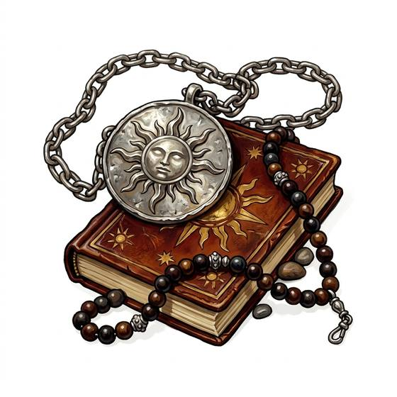

# Holy symbol

{.illus}

*Set: Core*

*aka: ______________________________*

*Faith, ritual and occult · Needs: stone tools · any*

An emblem of a god or a faith, carved from bone or wood or cast in metal, and worn at the throat or held up in rites. It marks the bearer as one of the faithful. In the dark, before something that should not exist, gripping it tightly can steady a trembling heart and put courage back into a shaking hand.

## Game block

- **Bonus:** +1 COU against the unholy
- **Penalty:** 0
- **Used for:** [Exorcism & Curse-Breaking](../Skills/exorcism-and-curse-breaking.md), [Ritual & Liturgy](../Skills/ritual-and-liturgy.md)
- **Weight:** 0.1 kg · **Needs:** stone tools · **Price:** 3 C
- **Also known as:** sacred emblem

## Not to be confused with

*[Protective Amulet](protective-amulet.md)*, a charm against ill luck and curses that belongs to folk magic rather than to any one faith.

