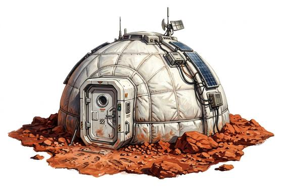

# Inflatable habitat

{.illus}

*Set: Expansion*

*aka: ______________________________*

*Camp and shelter · Needs: spaceflight · space-faring*

A folded bundle of tough, layered fabric that, filled from a gas bottle or a pump, swells into a pressurised room with an airlock and a clear panel for a window. Several people can live and sleep inside without helmets on an airless moon or a world with poison air. It creaks as it settles. Everyone inside becomes very interested in patches, seals and the sound of hissing.

## Game block

- **Bonus:** +2 END against vacuum or poison air
- **Penalty:** 0
- **Used for:** [Environment Suits](../Skills/environment-suits.md)
- **Weight:** 60 kg · **Needs:** spaceflight · **Price:** 80 S
- **Also known as:** expandable module

## Not to be confused with

*[Pressure Suit](pressure-suit.md)*, which keeps one person alive; the habitat keeps a whole group breathing without suits.

