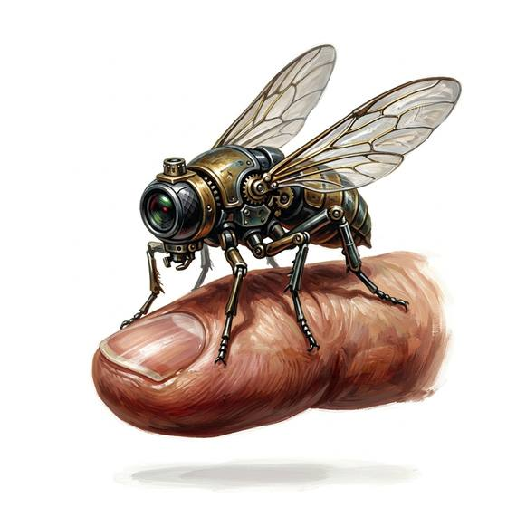

# Insect drone

{.illus}

*Set: Expansion*

*aka: ______________________________*

*Power, electronics and computing · Needs: spaceflight · space-faring*

A tiny drone no bigger than a fly, with shimmering wings and a camera as small as a grain of sand. It slips through keyholes and open windows, lands quietly on walls and ceilings, and watches and listens for its owner. Spies and investigators prize it. A single swat of a hand can end its career.

## Game block

- **Bonus:** +2 Shadowing & Surveillance spying indoors; +1 Stealth unseen scouting
- **Penalty:** 0
- **Used for:** [Drone Operation](../Skills/drone-operation.md)
- **Weight:** — · **Needs:** spaceflight · **Price:** 25 S
- **Also known as:** micro-drone

## Not to be confused with

the *[Camera Drone](camera-drone.md)*, which is larger and noisier, built for watching from the open air.

