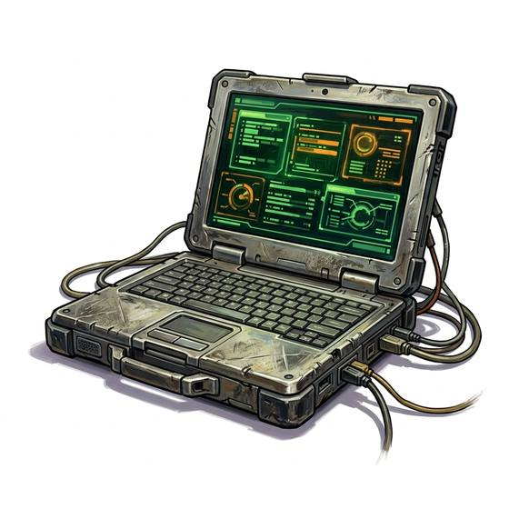

# Laptop computer

{.illus}

*Set: Expansion*

*aka: ______________________________*

*Power, electronics and computing · Needs: computing · modern*

A computer that folds shut like a book, with a screen in the lid and a keyboard in the base, and a battery that lasts a working day. Travellers, reporters and students carry them everywhere. It does nearly everything a desk computer does, only smaller and more fragile. A dropped laptop is a sad sight, and a stolen one is often worse.

## Game block

- **Bonus:** +1 Research searching stored records
- **Penalty:** 0
- **Used for:** [Computer Use](../Skills/computer-use.md), [Programming](../Skills/programming.md)
- **Weight:** 2 kg · **Needs:** computing · **Price:** 8 S
- **Also known as:** notebook computer

## Not to be confused with

the *[Desktop Computer](desktop-computer.md)*, which is sturdier but stays on its desk.

