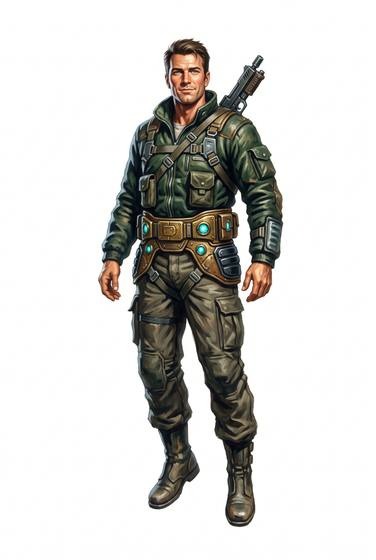

# Lift belt

{.illus}

*Set: Expansion*

*aka: ______________________________*

*Fields and far-future devices · Needs: far future · far future*

A broad belt with a glowing buckle that lets its wearer float slowly up or down through the air. It will not carry them forward or fast, but it will lift them up a wall, over a cliff or down from a great height with a soft landing. Builders, explorers and thieves use it. Rising slowly in plain sight, though, leaves its wearer exposed.

## Game block

- **Bonus:** +2 Climbing rising up walls and cliffs; +2 Jumping soft landings from any height
- **Penalty:** 0
- **Used for:** —
- **Weight:** 1.5 kg · **Needs:** far future · **Price:** 40 S
- **Also known as:** levitation belt

## Not to be confused with

the *[Low-G Jump Pack](low-g-jump-pack.md)*, which gives long bounds in low gravity rather than slow vertical flight.

