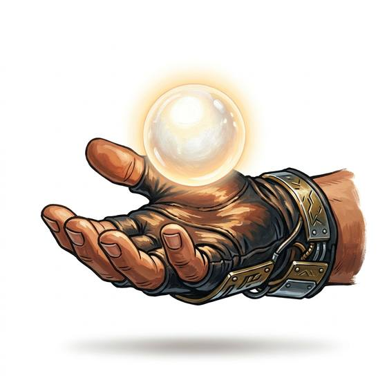

# Light orb

{.illus}

*Set: Expansion*

*aka: ______________________________*

*Light and fire · Needs: far future · far future*

A small floating sphere of light that follows its owner at shoulder height, brightening, dimming or moving ahead on command. It lights stairs, pages and dark corridors while leaving both hands free. Far-future travellers barely notice them any more, until they are without one.

## Game block

- **Bonus:** +1 Perception in darkness
- **Penalty:** 0
- **Used for:** —
- **Weight:** 0.1 kg · **Needs:** far future · **Price:** 8 S
- **Also known as:** drift light, floating lamp

## Not to be confused with

*[Headlamp](headlamp.md)*, the older way of keeping hands free, bound to the head and pointing where one looks.

