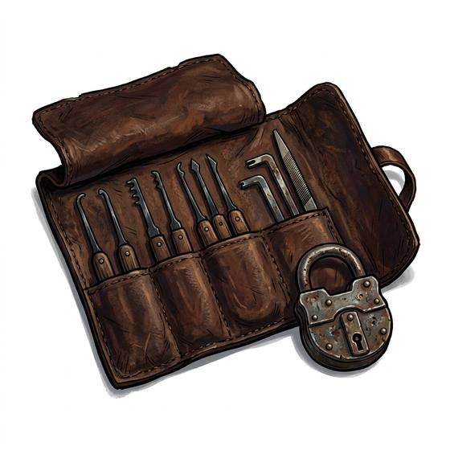

# Lockpicks

{.illus}

*Set: Core*

*aka: ______________________________*

*Security and thievery · Needs: iron · any*

A soft leather or cloth roll holding a handful of slim steel tools: hooked picks, bent turning wrenches, a probe or two filed from a knife blade. The picker feels for each ward or pin, puts gentle pressure on the lock and coaxes it round. In a skilled hand the roll opens doors, cases and cuffs. In a guard's hand, found in a stranger's boot, it is evidence.

## Game block

- **Bonus:** 0
- **Penalty:** 0
- **Used for:** [Lockpicking](../Skills/lockpicking.md)
- **Weight:** 0.1 kg · **Needs:** iron · **Price:** 5 S
- **Also known as:** picks and tension wrench

## Not to be confused with

*[Locksmith's Pick Set](locksmith-s-pick-set.md)*, a master craftsman's finer and fuller kit that makes delicate mechanical locks noticeably easier.

