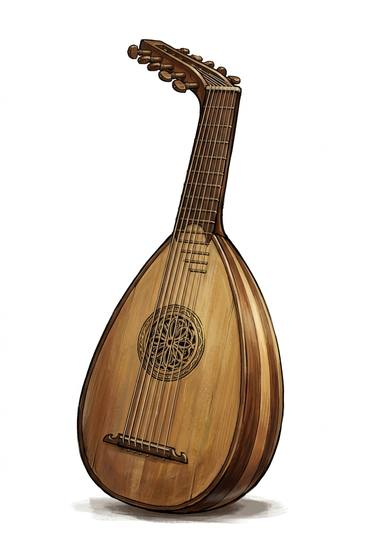

# Lute

{.illus}

*Set: Core*

*aka: ______________________________*

*Music, games and entertainment · Needs: iron · any*

A pear-shaped sound box with a rounded back built of thin wooden ribs, a fretted neck bent back sharply at the head, and paired strings of gut. It is plucked with the fingers or a quill and gives a warm, intimate tone suited to courts, taverns and love songs under windows. Lutes crack in the damp, need tuning every hour, and are forgiven for it because they sound lovely.

## Game block

- **Bonus:** 0
- **Penalty:** 0
- **Used for:** [Instrument (per instrument)](../Skills/instrument-per-instrument.md)
- **Weight:** 2 kg · **Needs:** iron · **Price:** 4 S
- **Also known as:** oud, pipa, long-necked lute

## Not to be confused with

*[Guitar](guitar.md)*, its flat-backed cousin of later ages, sturdier and easier to strum.

