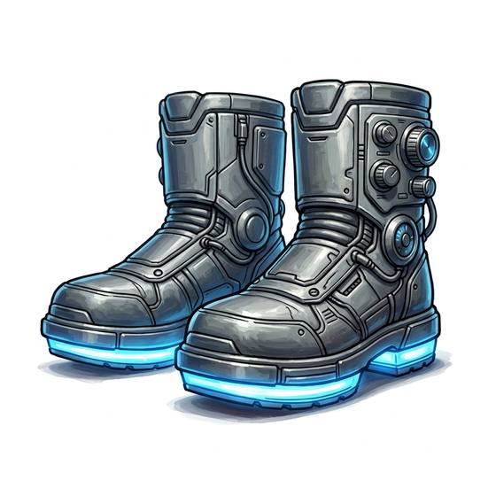

# Magnetic boots

{.illus}

*Set: Expansion*

*aka: ______________________________*

*Environment and survival gear · Needs: spaceflight · space-faring*

Heavy boots with thick metal soles that switch on and off with a click of the heel. Switched on, they grip any iron or steel surface, letting a crew member walk on the outside of a ship's hull or stand steady on a deck with no gravity at all. Every step is a deliberate lift and slam, slow and loud. Nobody sneaks up on anyone wearing magnetic boots.

## Game block

- **Slot:** feet
- **Bonus:** +2 Low & Zero Gravity staying anchored to a hull
- **Penalty:** −1 Stealth clanking on metal; −1 Running slow steps
- **Used for:** —
- **Weight:** 3 kg · **Needs:** spaceflight · **Price:** 15 S
- **Also known as:** mag boots

## Not to be confused with

*[Gravity Boots](gravity-boots.md)*, which make their own pull and work on any surface, not just metal.

