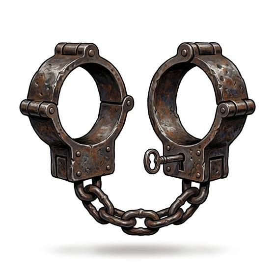

# Manacles

{.illus}

*Set: Core*

*aka: ______________________________*

*Security and thievery · Needs: iron · any*

Two thick iron rings, hinged and closed with a rivet, bolt or small lock, joined by a short length of chain. Snapped on the wrists, they leave a prisoner able to eat and walk but not to fight or climb. Gaolers, slavers and soldiers escorting captives have used them for as long as there has been iron. They are heavy, they chafe, and they rust into the skin of anyone left in them too long.

## Game block

- **Bonus:** 0
- **Penalty:** 0
- **Used for:** —
- **Weight:** 2 kg · **Needs:** iron · **Price:** 3 S
- **Also known as:** shackles, fetters

## Not to be confused with

*[Handcuffs](handcuffs.md)*, the lighter steel ratchet cuffs of later ages, quick to close and opened with a small key.

