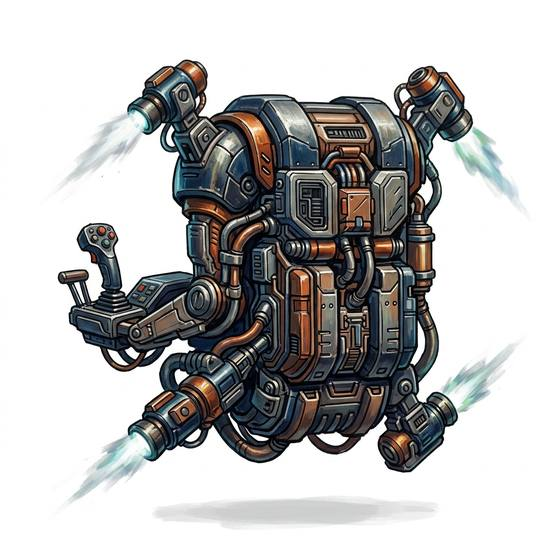

# Manoeuvring pack

{.illus}

*Set: Expansion*

*aka: ______________________________*

*Environment and survival gear · Needs: spaceflight · space-faring*

A compact backpack with small gas thrusters at each corner, controlled by hand grips on armrests. It lets a suited person float freely in open space, turning, stopping and moving without touching anything. Repair crews and boarding teams depend on it outside a ship. Each burst of gas leaves a small bright plume that can be seen from far away, and a pack that runs dry leaves its wearer drifting.

## Game block

- **Bonus:** +2 Low & Zero Gravity moving in open space
- **Penalty:** −1 Stealth visible gas jets
- **Used for:** [Environment Suits](../Skills/environment-suits.md)
- **Weight:** 20 kg · **Needs:** spaceflight · **Price:** 30 S
- **Also known as:** thruster pack, low-g thrusters

## Not to be confused with

the *[Low-G Jump Pack](low-g-jump-pack.md)*, which only lengthens hops on a surface; the manoeuvring pack flies free in weightlessness.

