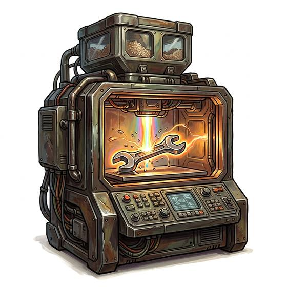

# Matter printer

{.illus}

*Set: Expansion*

*aka: ______________________________*

*Tools and trade kits · Needs: far future · far future*

A cabinet-sized fabricator that assembles objects from stored patterns and a hopper of raw feedstock, building them atom by atom or layer by fine layer. It can make tools, spare parts, clothing and even food, given the pattern and enough time. Societies that have them rarely lack for small things. Their patterns are guarded, traded and stolen, because the pattern is worth more than the machine.

## Game block

- **Bonus:** +2 Jury-Rigging replacing parts; +1 Mechanics any
- **Penalty:** 0
- **Used for:** [Jury-Rigging](../Skills/jury-rigging.md)
- **Weight:** 30 kg · **Needs:** far future · **Price:** 200 G
- **Also known as:** fabricator

## Not to be confused with

the *[3D Printer](3d-printer.md)*, an earlier machine that makes only simple plastic or metal parts.

