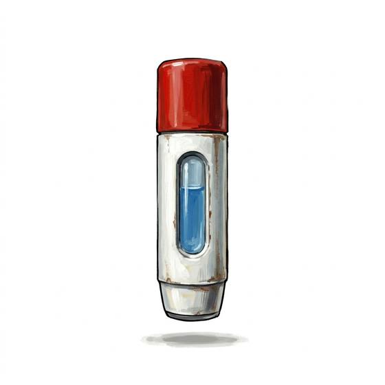

# Medical injector

{.illus}

*Set: Core*

*aka: ______________________________*

*Medicine and healing · Needs: spaceflight · space-faring*

A thumb-thick cylinder of hard plastic with a spring needle at one end, loaded with a cocktail of clotting agents, painkillers and stimulants. Jabbed into a wounded crewmate, it slows the bleeding, dulls the pain and pulls them back to their feet in moments. Spacers, soldiers and explorers carry several in pockets across the chest. It patches the damage without erasing it; a real surgeon will still be needed later.

## Game block

- **Bonus:** +2 Life restores Life when injected (Quick Heal)
- **Penalty:** 0
- **Used for:** —
- **Weight:** 0.1 kg · **Needs:** spaceflight · **Price:** 20 S
- **Also known as:** auto-injector, heal shot

## Not to be confused with

*[Painkiller Injector](painkiller-injector.md)*, which only hides the pain; the medical injector begins to repair the wound as well.

