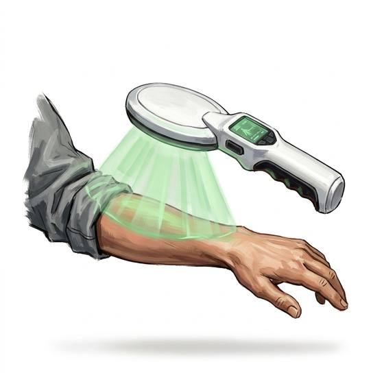

# Medical scanner

{.illus}

*Set: Expansion*

*aka: ______________________________*

*Optics, sensing and scanners · Needs: spaceflight · space-faring*

A smooth wand passed slowly over a patient from head to foot, humming as it goes. Its little screen shows the pulse, the breathing, the fever, the fracture hidden in a swollen arm and the pool of blood gathering where no bruise shows yet. Field medics love it because it finds the injury the patient is too shocked to feel. It tells you what is wrong; fixing it is still somebody's job.

## Game block

- **Bonus:** +2 Medicine diagnosing illness; +1 First Aid finding hidden injuries
- **Penalty:** 0
- **Used for:** [Medicine](../Skills/medicine.md)
- **Weight:** 0.5 kg · **Needs:** spaceflight · **Price:** 20 S
- **Also known as:** diagnostic scanner

## Not to be confused with

the *[Auto-Doc Wand](auto-doc-wand.md)*, which treats wounds as well as reading them; the medical scanner only diagnoses.

