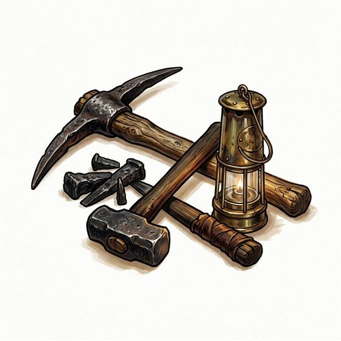

# Miner's tools

{.illus}

*Set: Expansion*

*aka: ______________________________*

*Tools and trade kits · Needs: bronze · any*

Iron picks, wedges, a heavy hammer, a chisel and woven baskets for carrying ore to the surface. Miners use them to break rock in the dark, deep underground, where every blow echoes and every pause means listening for the creak of timbers. Mining is hard, dangerous and poorly rewarded, and mining towns are rough, proud places.

## Game block

- **Bonus:** 0
- **Penalty:** 0
- **Used for:** [Mining & Quarrying](../Skills/mining-and-quarrying.md)
- **Weight:** 12 kg · **Needs:** bronze · **Price:** 15 S
- **Also known as:** pick and hod

## Not to be confused with

the *[Prospector's Kit](prospector-s-kit.md)*, which finds ore rather than digging it out.

