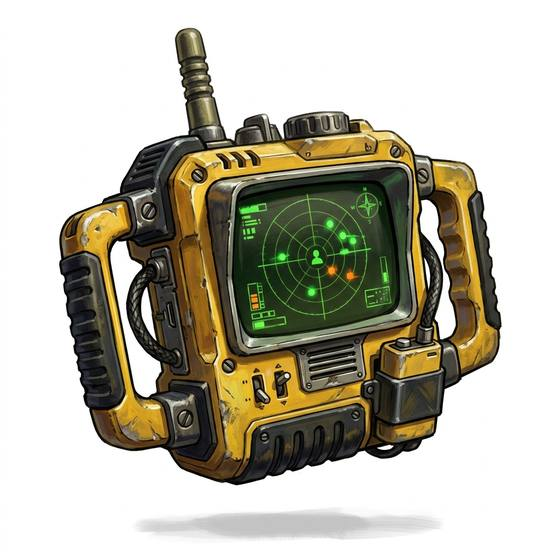

# Motion tracker

{.illus}

*Set: Expansion*

*aka: ______________________________*

*Optics, sensing and scanners · Needs: spaceflight · space-faring*

A handheld box with a curved screen and a sweeping arc, showing moving things around the holder as blips, nearer or farther. Its steady chirp speeds up as something closes in, which is either comforting or unbearable. Security teams and explorers of dark places carry it to know what is coming before it arrives. Its great weakness is simple: anything that stays perfectly still does not exist to it.

## Game block

- **Bonus:** +2 Danger Sense movement nearby
- **Penalty:** −1 Perception anything that stays still
- **Used for:** —
- **Weight:** 1 kg · **Needs:** spaceflight · **Price:** 20 S

## Not to be confused with

the *[Life-Sign Detector](life-sign-detector.md)*, which finds the living by heartbeat and warmth even when they are motionless.

