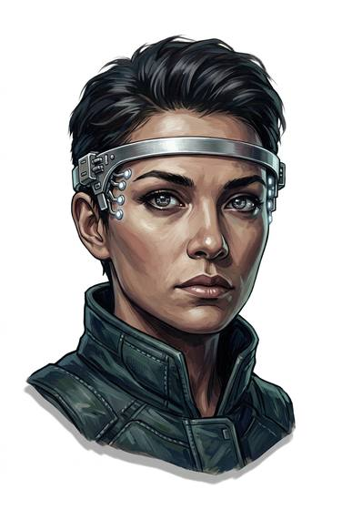

# Neural interface

{.illus}

*Set: Expansion*

*aka: ______________________________*

*Power, electronics and computing · Needs: spaceflight · space-faring*

A thin headband with small pads resting against the temples, reading the faint signals of intent inside the wearer's head. With it, a person can move a cursor, open a file or fly a drone simply by thinking about it. Pilots, hackers and people who have lost the use of their hands find it a marvel. When a link is cut suddenly, the feedback hits like a slap to the mind.

## Game block

- **Slot:** head
- **Bonus:** +1 Computer Use controlling machines by thought; +1 Drone Operation flying by thought
- **Penalty:** −1 Composure feedback shock when a link is cut
- **Used for:** —
- **Weight:** 0.2 kg · **Needs:** spaceflight · **Price:** 40 S
- **Also known as:** neural headset

## Not to be confused with

the *[Wrist Computer](wrist-computer.md)*, which is worked by hand; the neural interface answers to thought alone.

