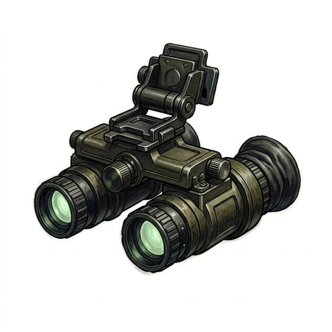

# Night-vision goggles

{.illus}

*Set: Core*

*aka: ______________________________*

*Optics, sensing and scanners · Needs: computing · modern*

Head-mounted tubes that gather starlight and moonlight and amplify it into a flat, green-tinted picture of the dark. The wearer sees and searches where others stumble. A sudden bright light floods them and blinds the wearer for a moment, and judging distances through them is hard, so stairs and quick movements come as nasty surprises.

## Game block

- **Slot:** face
- **Bonus:** +2 Perception in darkness; +1 Searching in darkness
- **Penalty:** −2 Perception when a bright light flares; −1 Dodge poor depth judgement
- **Used for:** —
- **Weight:** 0.8 kg · **Needs:** computing · **Price:** 20 S
- **Also known as:** night sight

## Not to be confused with

*[Thermal Viewer](thermal-viewer.md)*, which shows heat rather than faint light, and sees through smoke.

