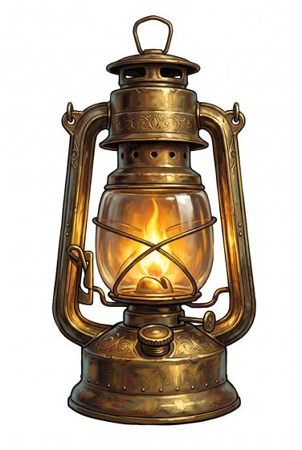

# Oil lantern

{.illus}

*Set: Core*

*aka: ______________________________*

*Light and fire · Needs: steam · industrial cities*

A lantern of tin and glass with a tall chimney, burning paraffin or whale oil from a reservoir below. Its flame stays lit in wind and rain, and its light carries along a quay or a road. Night watchmen, railwaymen and coachmen in the industrial cities swing them on their rounds.

## Game block

- **Bonus:** +1 Perception in wind and rain at night
- **Penalty:** 0
- **Used for:** —
- **Weight:** 1.2 kg · **Needs:** steam · **Price:** 5 S
- **Also known as:** hurricane lamp, storm lantern

## Not to be confused with

*[Pressure lantern](pressure-lantern.md)*, which pumps its fuel through a glowing mantle for a far brighter light.

