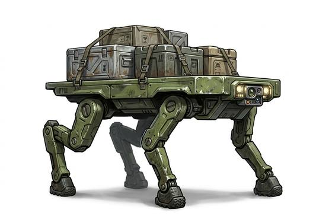

# Pack robot

{.illus}

*Set: Expansion*

*aka: ______________________________*

*Power, electronics and computing · Needs: spaceflight · space-faring*

A four-legged walking robot about the size of a pony, carrying heavy loads on its back and following its owner step for step. It climbs over rocks, through mud and up slopes where wheels would fail. Soldiers and explorers use it to carry supplies. Its legs whir and clank constantly, and it tends to wander into the wrong places if not watched.

## Game block

- **Bonus:** +2 Lifting & Carrying hauling loads over rough ground
- **Penalty:** −1 Stealth whirring legs
- **Used for:** [Robotics](../Skills/robotics.md)
- **Weight:** 40 kg · **Needs:** spaceflight · **Price:** 80 S
- **Also known as:** cargo walker

## Not to be confused with

the *[Anti-Grav Sled](anti-grav-sled.md)*, which floats a load along on flat ground but cannot climb rough terrain.

