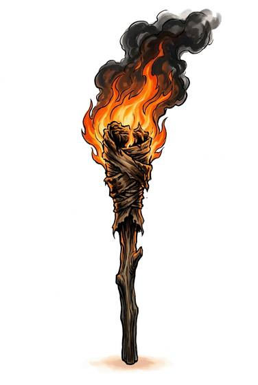

# Pitch torch

{.illus}

*Set: Core*

*aka: ______________________________*

*Light and fire · Needs: fire · any*

A stick wrapped in rag soaked in pitch or resin, burning with a bright, smoky, crackling flame. It lights a cave or a castle stair, and wild beasts shy away from it. It also announces its bearer to everyone in sight, spits burning drops and makes the air thick with smoke.

## Game block

- **Bonus:** +1 Intimidation against animals
- **Penalty:** −2 Stealth while lit
- **Used for:** —
- **Weight:** 0.8 kg · **Needs:** fire · **Price:** 1 C
- **Also known as:** brand, firebrand

## Not to be confused with

*[Oil lantern](oil-lantern.md)*, which gives a steadier light in a glass that wind and rain cannot reach.

