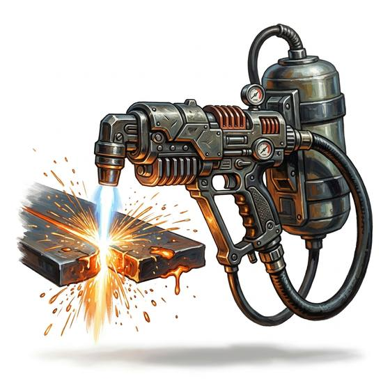

# Plasma cutter

{.illus}

*Set: Expansion*

*aka: ______________________________*

*Tools and trade kits · Needs: spaceflight · space-faring*

A handheld torch that drives a thin jet of superheated gas through steel plate, leaving a glowing slag-edged cut. Salvage crews use it to strip wrecks, rescue teams to cut through bulkheads and burglars to open things they shouldn't. It needs heavy power and protective gear, and the hiss and blinding glare make it impossible to use unnoticed.

## Game block

- **Bonus:** +1 Machining & Welding cutting metal
- **Penalty:** −1 Stealth while in use
- **Used for:** [Machining & Welding](../Skills/machining-and-welding.md)
- **Weight:** 6 kg · **Needs:** spaceflight · **Price:** 30 S
- **Also known as:** cutting torch

## Not to be confused with

the *[Welding Kit](welding-kit.md)*, which joins metal as well as cutting it, but more slowly.

