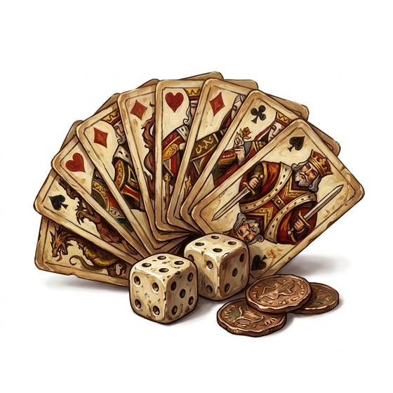

# Playing cards

{.illus}

*Set: Core*

*aka: ______________________________*

*Music, games and entertainment · Needs: printing · any*

A deck of painted or printed cards, marked in suits and ranks, with gaudy court figures and a card or two of fools. They are used for a hundred games of chance and skill, for solitaire on long nights, and for tricks that impress children. A deck slips into a pocket, travels anywhere, and draws a crowd of strangers to any table.

## Game block

- **Bonus:** 0
- **Penalty:** 0
- **Used for:** [Games & Gambling](../Skills/games-and-gambling.md)
- **Weight:** 0.1 kg · **Needs:** printing · **Price:** 5 C
- **Also known as:** card deck

## Not to be confused with

*[Marked Cards](marked-cards.md)*, the cheat's deck, carrying secret signs on the backs.

