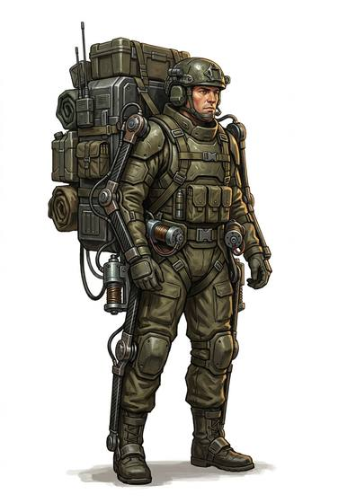

# Powered exoframe pack

{.illus}

*Set: Expansion*

*aka: ______________________________*

*Carrying and containers · Needs: spaceflight · space-faring*

A backpack frame fitted with small motors at the hips and shoulders that take up much of the weight as the wearer walks. Colonists and survey teams use them to haul heavy loads over rough ground for days on end without breaking their backs. The motors whine softly with every step, which is fine in a work crew and bad in hostile country.

## Game block

- **Bonus:** +2 Lifting & Carrying heavy loads; +1 Endurance long marches
- **Penalty:** −1 Stealth motor whine
- **Used for:** —
- **Weight:** 6 kg · **Needs:** spaceflight · **Price:** 40 S
- **Also known as:** assisted carrier

## Not to be confused with

*[Anti-grav carrier](anti-grav-carrier.md)*, which floats the load entirely rather than helping the wearer carry it.

