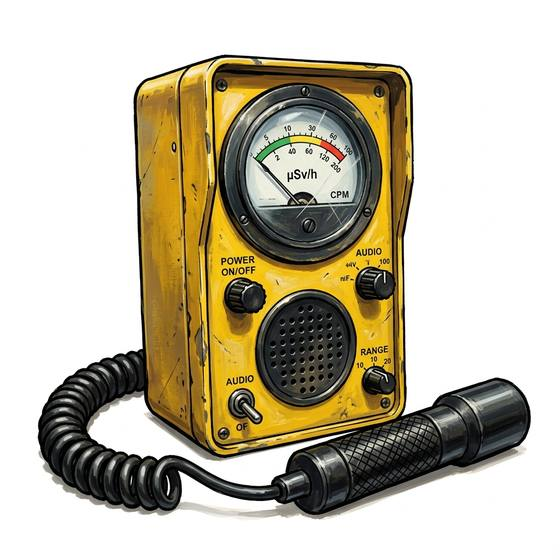

# Radiation counter

{.illus}

*Set: Expansion*

*aka: ______________________________*

*Optics, sensing and scanners · Needs: electricity · modern*

A wand-shaped tube on a cable, joined to a box with a needle and a speaker. It clicks. In a quiet place it ticks now and then like a slow clock; near something dangerous the clicks run together into a hiss, and the needle leans hard over. Prospectors sweep it across rocks, soldiers over ruined cities, and survivors over the water they want to drink. Nobody who has heard that hiss ever forgets it.

## Game block

- **Bonus:** +2 Danger Sense radiation; +1 Searching finding radioactive sources
- **Penalty:** 0
- **Used for:** [Physical Sciences](../Skills/physical-sciences.md)
- **Weight:** 1.5 kg · **Needs:** electricity · **Price:** 15 S
- **Also known as:** geiger counter, clicker

## Not to be confused with

the *[Dosimeter Badge](dosimeter-badge.md)*, which only keeps a running total of what you have taken; the counter tells you what is here, now.

