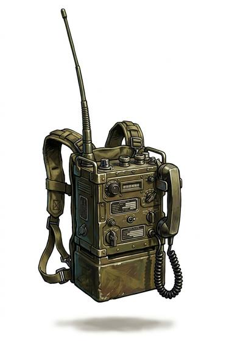

# Radio set

{.illus}

*Set: Core*

*aka: ______________________________*

*Communication and signalling · Needs: electricity · modern*

A heavy backpack of valves, batteries and dials, with a telephone-style handset and a long whip aerial. It carries voices or coded signals over many kilometres, linking patrols to headquarters and ships to shore. The operator is a precious and conspicuous member of any unit, since the aerial sticks up above everyone's heads. Anyone listening on the right frequency may be able to overhear.

## Game block

- **Bonus:** +1 Communications & Sensors long range
- **Penalty:** 0
- **Used for:** [Communications & Sensors](../Skills/communications-and-sensors.md), [Signals](../Skills/signals.md)
- **Weight:** 12 kg · **Needs:** electricity · **Price:** 30 S
- **Also known as:** backpack radio, field radio

## Not to be confused with

*[Walkie Radio](walkie-radio.md)*, which is small and short-ranged; the radio set is heavy and reaches much farther.

