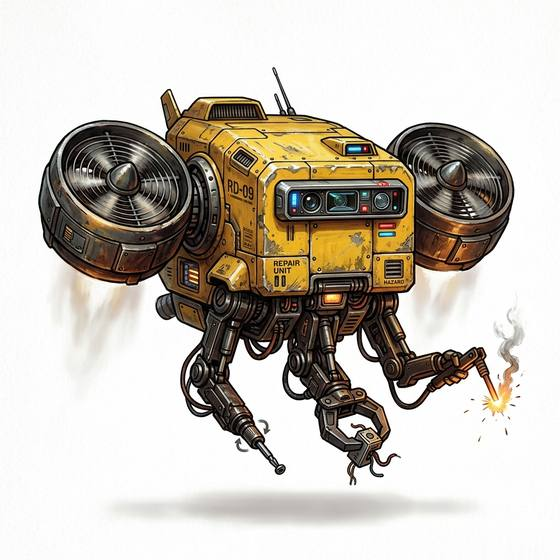

# Repair drone

{.illus}

*Set: Expansion*

*aka: ______________________________*

*Power, electronics and computing · Needs: spaceflight · space-faring*

A small hovering drone with thin tool arms folded beneath it, which flies and crawls into places a person cannot reach: inside engines, along cables and across the outer hull of a ship. It welds, tightens and replaces parts under the watch of its operator. Crews grow fond of their repair drones and often give them names.

## Game block

- **Bonus:** +1 Mechanics reaching tight spots; +1 Starship Engineering hull and exterior repairs
- **Penalty:** 0
- **Used for:** [Drone Operation](../Skills/drone-operation.md)
- **Weight:** 5 kg · **Needs:** spaceflight · **Price:** 60 S
- **Also known as:** maintenance drone

## Not to be confused with

the *[Repair Swarm](repair-swarm.md)*, a cloud of tiny machines that mend damage by themselves rather than one drone guided by an operator.

