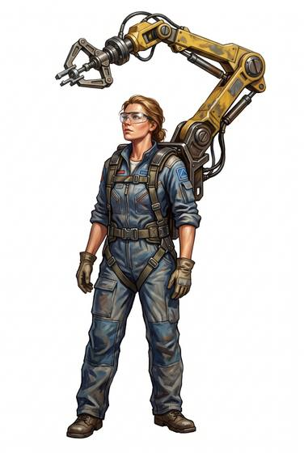

# Robotic tool arm

{.illus}

*Set: Expansion*

*aka: ______________________________*

*Power, electronics and computing · Needs: spaceflight · space-faring*

A mechanical arm mounted on a harness at the shoulder or the waist, with a set of tool heads that click on and off. It holds work steady, lifts heavy parts and passes tools, like a patient apprentice who never gets tired. Mechanics and welders love it. The harness is bulky, though, and the arm catches on doorframes and gets in the way of any quick move.

## Game block

- **Bonus:** +1 Machining & Welding holding work steady; +1 Lifting & Carrying steady heavy lifting
- **Penalty:** −1 Dodge bulky rig
- **Used for:** [Robotics](../Skills/robotics.md)
- **Weight:** 6 kg · **Needs:** spaceflight · **Price:** 50 S
- **Also known as:** tool arm

## Not to be confused with

the *[Repair Drone](repair-drone.md)*, which flies off on its own to reach tight spots rather than staying attached to the worker.

