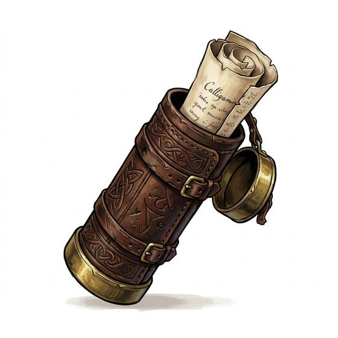

# Scroll case

{.illus}

*Set: Expansion*

*aka: ______________________________*

*Carrying and containers · Needs: writing · any*

A capped cylinder of leather, wood, bone or metal that keeps a rolled map, letter or scroll dry, flat and uncrushed. Messengers carry them across their backs, scholars stack them on shelves, and a sealed case tells anyone who handles it that the contents matter.

## Game block

- **Bonus:** 0
- **Penalty:** 0
- **Used for:** —
- **Weight:** 0.4 kg · **Needs:** writing · **Price:** 1 S
- **Also known as:** map tube, document tube

## Not to be confused with

*[Map case](map-case.md)*, a flat case for folded maps used in the field.

