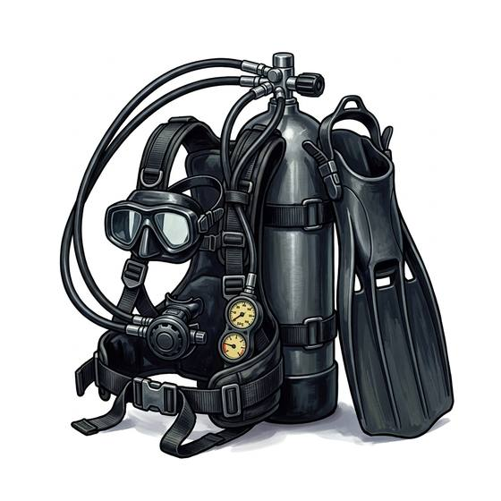

# Scuba set

{.illus}

*Set: Expansion*

*aka: ______________________________*

*Environment and survival gear · Needs: electricity · modern*

A steel or aluminium tank of compressed air strapped to the back, with a regulator that hands the diver a breath whenever they suck on the mouthpiece. It is freedom underwater: no hose, no walking, just gliding through wrecks and reefs like a fish. Divers, salvagers and treasure hunters swear by it. Every breath out rises to the surface in a silver stream that anyone watching from above can follow.

## Game block

- **Bonus:** +2 Diving free-swimming dives
- **Penalty:** −1 Stealth trail of bubbles
- **Used for:** [Diving](../Skills/diving.md)
- **Weight:** 15 kg · **Needs:** electricity · **Price:** 20 S
- **Also known as:** aqualung, air tank and regulator

## Not to be confused with

the *[Rebreather](rebreather.md)*, which recycles the diver's breath and leaves no bubbles behind.

