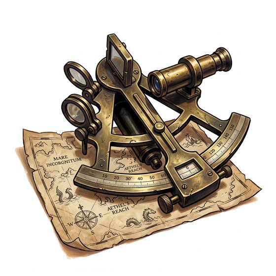

# Sextant

{.illus}

*Set: Expansion*

*aka: ______________________________*

*Navigation and timekeeping · Needs: steam · sea peoples*

An arc of polished brass with a swinging arm, a small telescope and two mirrors. The navigator brings the sun or a star down to meet the horizon in the glass and reads the angle off the scale. Paired with good tables and a good clock, it fixes a ship's place on an empty ocean. It is delicate, costly and kept in a padded box, and a navigator who drops it overboard may well follow it.

## Game block

- **Bonus:** +2 Sea Navigation finding position
- **Penalty:** 0
- **Used for:** [Sea Navigation](../Skills/sea-navigation.md), [Mathematics](../Skills/mathematics.md)
- **Weight:** 1.5 kg · **Needs:** steam · **Price:** 8 S
- **Also known as:** octant, quadrant

## Not to be confused with

the *[Cross Staff](cross-staff.md)*, which measures the same angles with a sliding crosspiece, cheaply but roughly.

