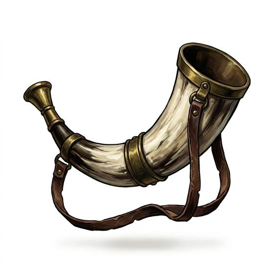

# Signal horn

{.illus}

*Set: Core*

*aka: ______________________________*

*Communication and signalling · Needs: stone tools · any*

The curved horn of a ram or ox, or a great spiral seashell, with the tip cut off to make a mouthpiece. Blown hard, it sends a deep, carrying note across fields, valleys and water. Herders call their animals with it, watchmen raise the alarm, and war bands rally to it. Everyone for miles around hears it, and that includes anyone who was not supposed to know where the horn-blower was.

## Game block

- **Bonus:** +1 Signals outdoors over distance
- **Penalty:** −2 Stealth once blown
- **Used for:** [Signals](../Skills/signals.md)
- **Weight:** 0.5 kg · **Needs:** stone tools · **Price:** 5 C
- **Also known as:** hunting horn, conch trumpet, war horn

## Not to be confused with

*[Bugle](bugle.md)*, which plays a set of formal calls; the signal horn gives a single loud blast.

