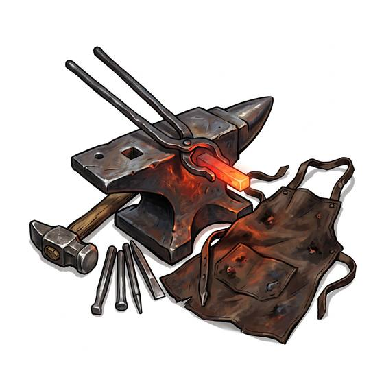

# Smith's tools

{.illus}

*Set: Expansion*

*aka: ______________________________*

*Tools and trade kits · Needs: iron · any*

A heavy bundle of hammers, tongs, punches, chisels and a small anvil, carried in a wagon or on a strong horse. With a fire hot enough, a smith can mend a broken hinge, reshoe a horse or straighten a bent blade far from any town. The work rings across the camp and the smoke carries far, so a smith at work is never a secret.

## Game block

- **Bonus:** 0
- **Penalty:** −1 Stealth while working
- **Used for:** [Blacksmithing](../Skills/blacksmithing.md)
- **Weight:** 15 kg · **Needs:** iron · **Price:** 60 S
- **Also known as:** forge kit, blacksmith's tools

## Not to be confused with

the *[Portable Forge](portable-forge.md)*, which provides the fire and bellows that these tools need.

