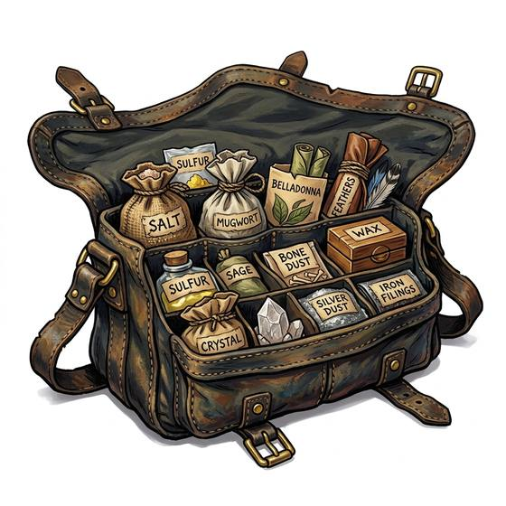

# Spell components pouch

{.illus}

*Set: Core*

*aka: ______________________________*

*Faith, ritual and occult · Needs: — · any*

A leather pouch of small labelled compartments, filled with dried herbs, powdered bone, salt, wax, iron filings, feathers, bits of string and odd little stones. Everything a hedge witch or a travelling mage might need for a common charm is there, and a few things nobody remembers the purpose of. It smells of dust and lavender and something less pleasant.

## Game block

- **Bonus:** +1 Folk Magic common charms
- **Penalty:** 0
- **Used for:** [Folk Magic](../Skills/folk-magic.md), [Arcana](../Skills/arcana.md)
- **Weight:** 0.5 kg · **Needs:** — · **Price:** 5 S
- **Also known as:** witch's pouch, reagent pouch

## Not to be confused with

*[Warding Kit](warding-kit.md)*, a set of supplies for one particular job, sealing a room against spirits.

