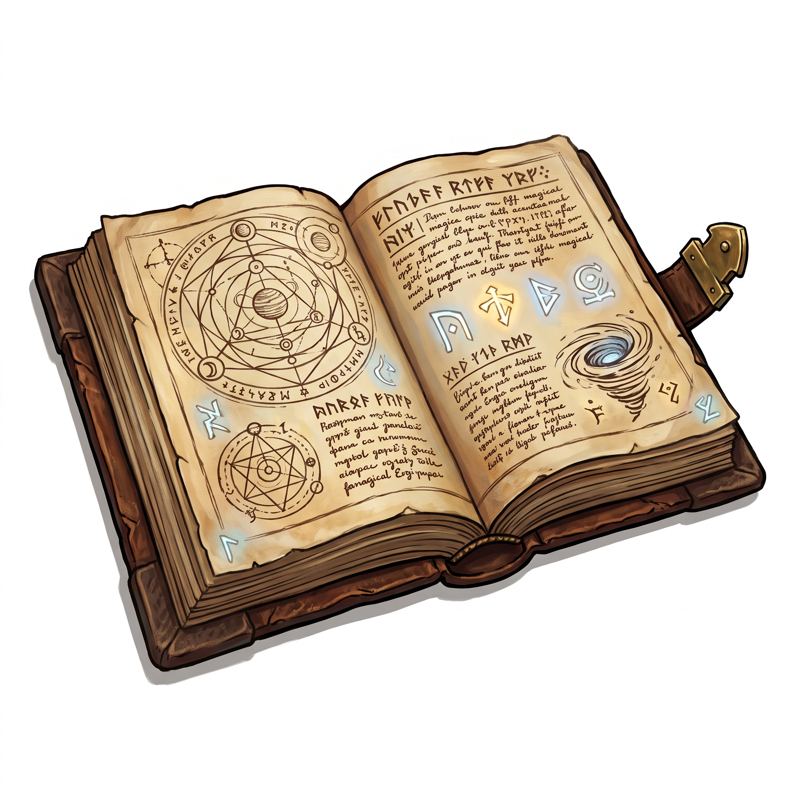

# Spellbook

{.illus}

*Set: Core*

*aka: ______________________________*

*Faith, ritual and occult · Needs: writing · any*

A book of rites, sigils, incantations and recipes for magic, handwritten by its owner or copied from older books, with notes and warnings scrawled in the margins. For a mage, it is a lifetime's knowledge and the most valuable thing they own. It is often locked, hidden, or written in a private cipher, and a stolen one is a disaster.

## Game block

- **Bonus:** +1 Arcana rites it records
- **Penalty:** 0
- **Used for:** [Arcana](../Skills/arcana.md)
- **Weight:** 1.5 kg · **Needs:** writing · **Price:** 15 G
- **Also known as:** grimoire

## Not to be confused with

*[Holy Book](holy-book.md)*, the scriptures of a faith, where the spellbook records the working of magic.

