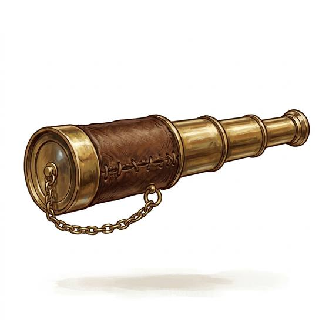

# Spyglass

{.illus}

*Set: Core*

*aka: ______________________________*

*Optics, sensing and scanners · Needs: printing · seafaring peoples*

A brass tube of lenses that slides out in sections to bring distant things close: a sail on the horizon, a rider on a far ridge, a flag on a fortress wall. Sailors and scouts carry them, and a captain with a spyglass sees trouble long before it arrives. While looking through it, though, the world close at hand disappears, and someone may be standing right beside you.

## Game block

- **Bonus:** +2 Perception spotting things far away
- **Penalty:** −1 Perception noticing anything close by while looking
- **Used for:** [Sea Navigation](../Skills/sea-navigation.md)
- **Weight:** 1 kg · **Needs:** printing · **Price:** 8 S
- **Also known as:** collapsible telescope, ship's glass

## Not to be confused with

*[Binoculars](binoculars.md)*, a later two-eyed version, steadier and easier to use for long watching.

