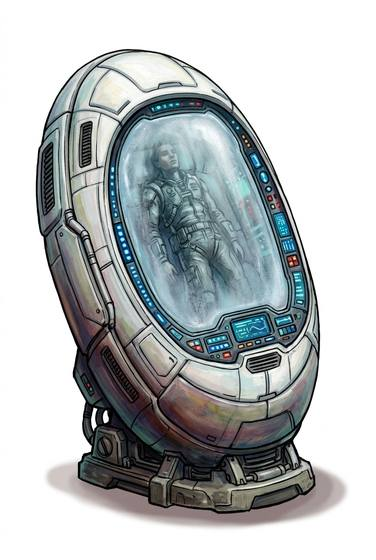

# Stasis pod

{.illus}

*Set: Expansion*

*aka: ______________________________*

*Fields and far-future devices · Needs: far future · far future*

A coffin-sized pod that halts all change in the person placed inside it. A dying casualty stays exactly as they were until a surgeon can reach them. Field medics and rescue teams carry them on ships and in vehicles. Waking from one is disorienting; patients often think no time has passed.

## Game block

- **Bonus:** +2 Field Medicine stabilising a dying patient
- **Penalty:** 0
- **Used for:** —
- **Weight:** 60 kg · **Needs:** far future · **Price:** 150 G
- **Also known as:** casualty pod

## Not to be confused with

the *[Stasis Box](stasis-box.md)*, which preserves objects and samples rather than a whole person.

