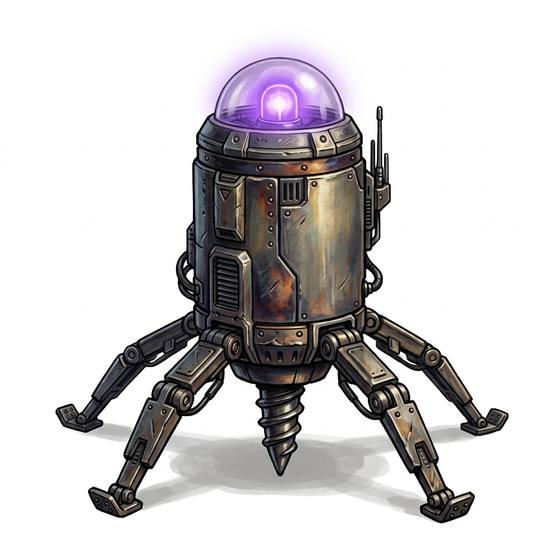

# Teleport beacon

{.illus}

*Set: Expansion*

*aka: ______________________________*

*Fields and far-future devices · Needs: far future · far future*

A small metal beacon, often pinned to a belt or a collar, that marks its carrier for a ship's teleporter to lock on and pull them home. Explorers and soldiers carry them into danger for a quick escape. Its signal is constant, though, and anyone with the right equipment can track it.

## Game block

- **Bonus:** 0
- **Penalty:** −1 Stealth its signal can be tracked
- **Used for:** —
- **Weight:** 0.3 kg · **Needs:** far future · **Price:** 20 S
- **Also known as:** recall beacon

## Not to be confused with

the *[Emergency Beacon](emergency-beacon.md)*, which only calls for help; the teleport beacon brings its carrier home.

